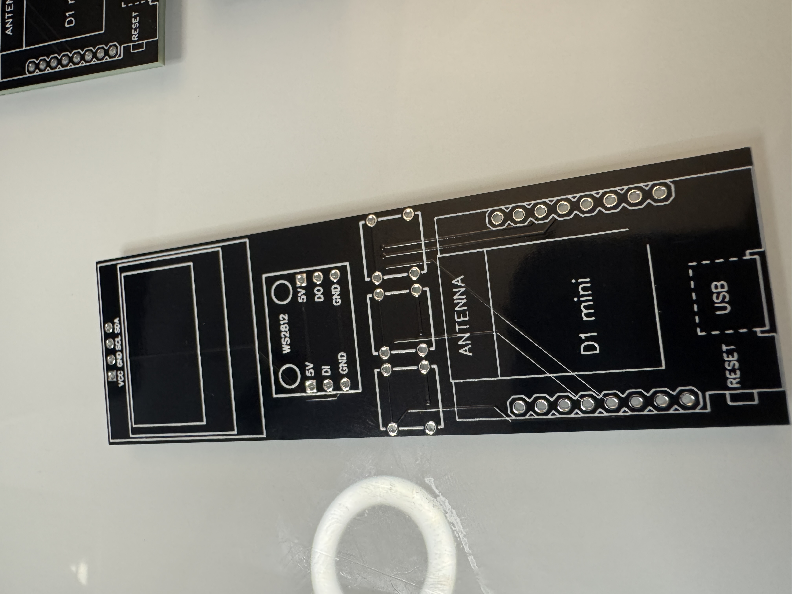
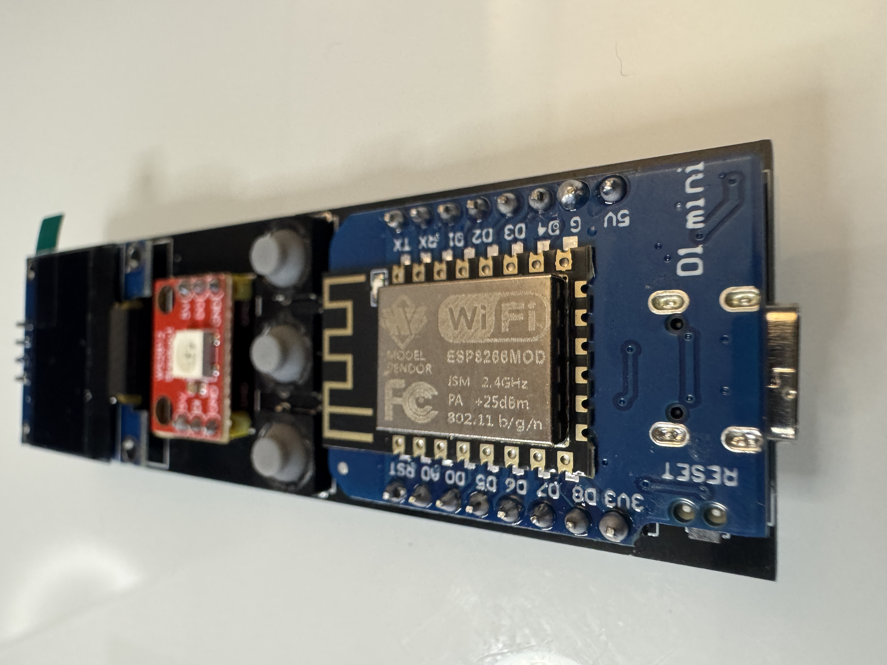
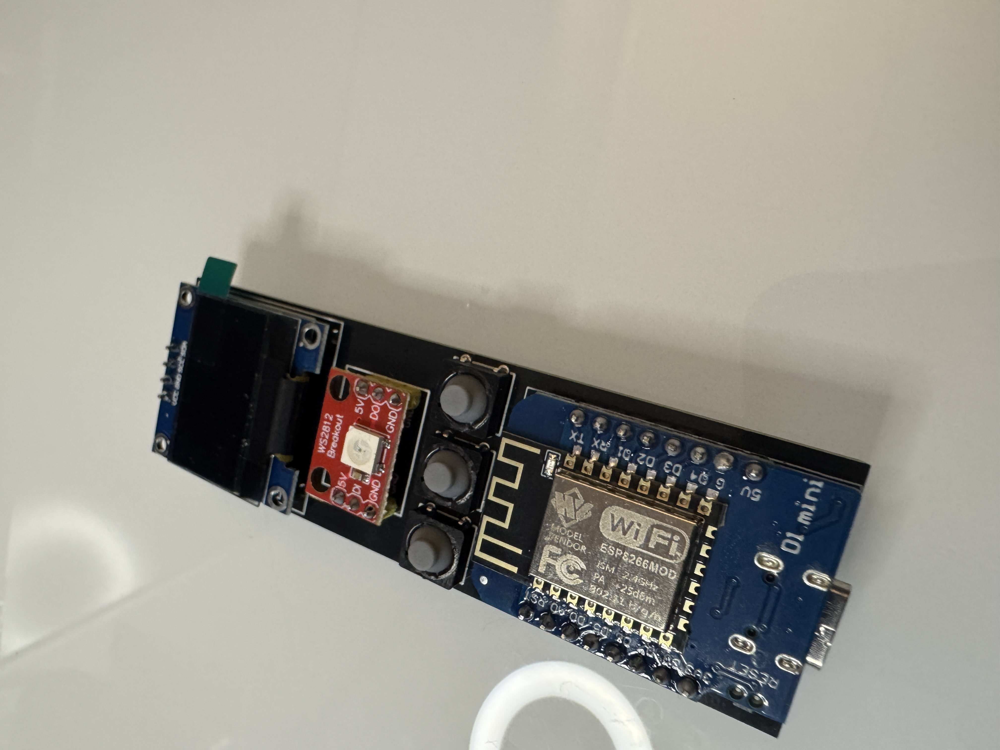
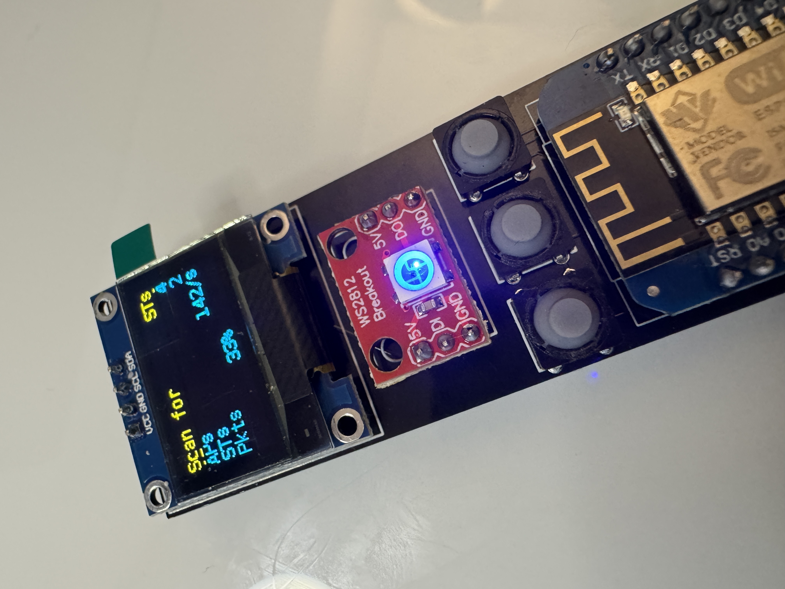
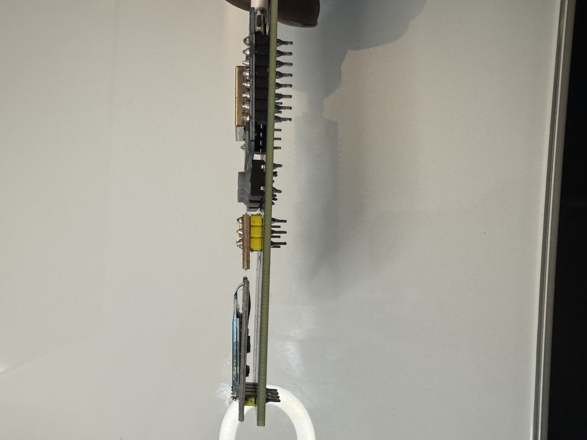
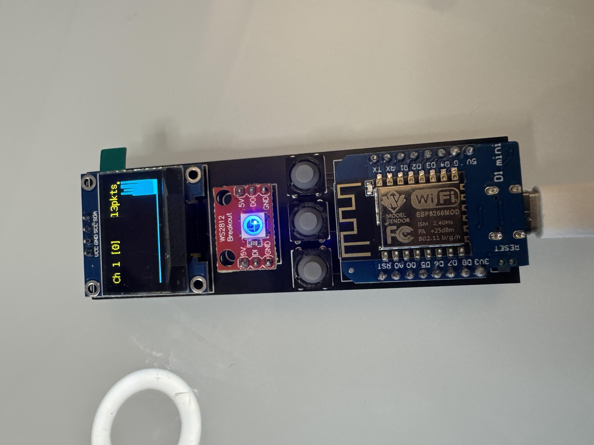
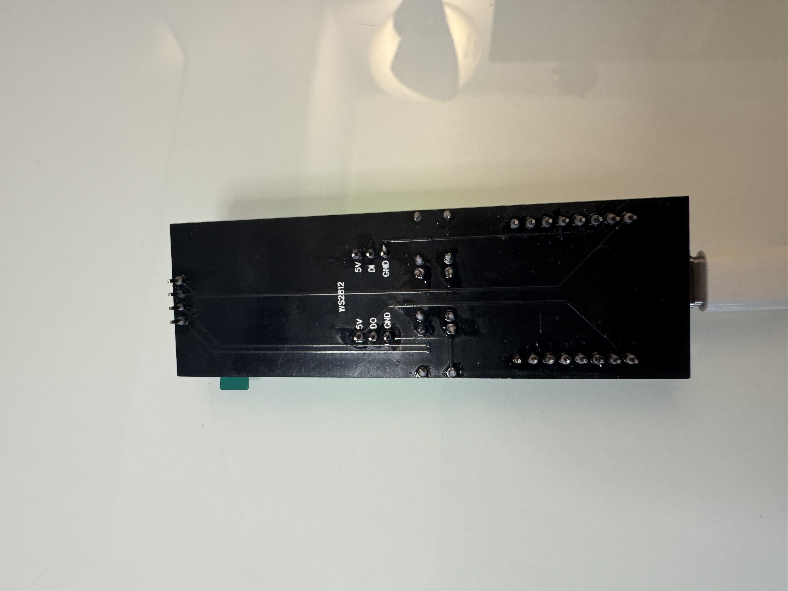
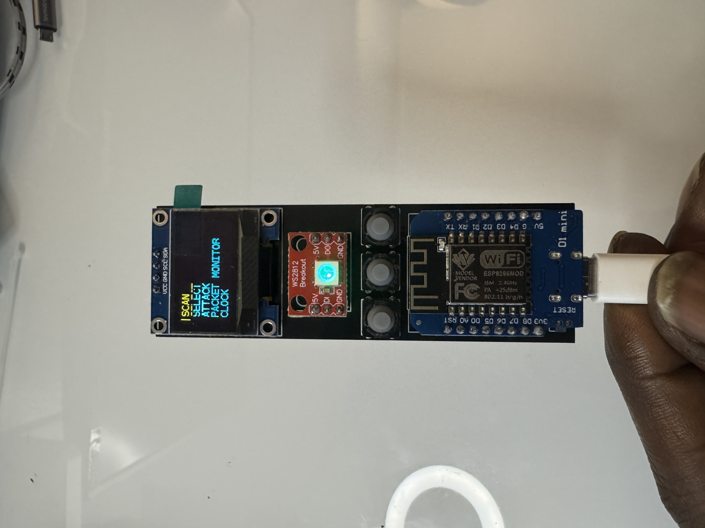

# Deauther Nano Hardware Repo

## New design for Spacehuhn's WiFi Deauther!
You can find all the hardware files you need to make your own PCB with a Wemos D1 Mini ESP8266 in the "hardware" folder.

# ESP8266 Deauther

**Scan for WiFi devices, block selected connections, create dozens of networks and confuse WiFi scanners.**

## New Documentation

Hi 👋  
Please visit [Deauther.com](https://deauther.com) for information about this project.  
Here are some quick links:

* [Buy](https://deauther.com/docs/buy)
* [Download](https://deauther.com/docs/download)
* [DIY Tutorial](https://deauther.com/docs/category/diy-tutorial)
* [Usage](https://deauther.com/docs/category/usage)
* [FAQ](https://deauther.com/docs/faq)

## Password

The password for `pwned` is `deauther`

## About this Project

This firmware allows you to easily perform a variety of actions to test 802.11 networks using an [ESP8266](https://www.espressif.com/en/products/socs/esp8266). It's also a great project for learning about WiFi, microcontrollers, Arduino, hacking and electronics/programming in general.  

The deauthentication attack is the main feature, which can be used to disconnect devices from their WiFi network.  
Although this denial-of-service attack is nothing new, a lot of devices are still vulnerable to it. Luckily this is slowly changing with more WiFi 6 enabled devices being used. But a lot of outdated WiFi devices remain in place, for example in cheap IoT hardware.
With an ESP8266 Deauther, you can easily test this attack on your 2.4GHz WiFi network/devices and see whether it's successful or not. And if it is, you know you should upgrade your network.

## Disclaimer

This project is a proof of concept for testing and educational purposes.  
Neither the ESP8266, nor its SDK was meant or built for such purposes. **Bugs can occur!**  

**Use it only against your own networks and devices!**  
Please check the legal regulations in your country before using it.  
We don't take any responsibility for what you do with this program.  
